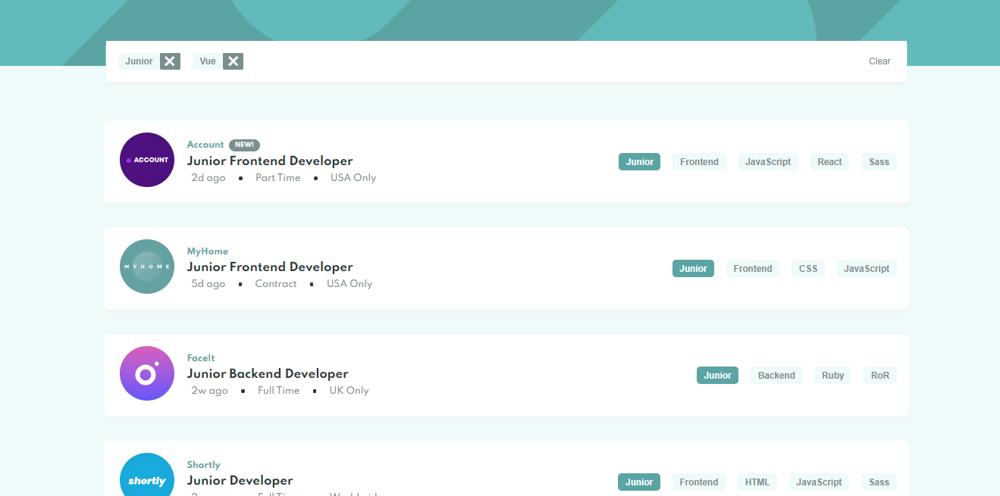

# Frontend Mentor - Job listings with filtering solution

This is a solution to the [Job listings with filtering challenge on Frontend Mentor](https://www.frontendmentor.io/challenges/job-listings-with-filtering-ivstIPCt). Frontend Mentor challenges help you improve your coding skills by building realistic projects. 

## Table of contents

- [Overview](#overview)
  - [The challenge](#the-challenge)
  - [Screenshot](#screenshot)
  - [Links](#links)
- [My process](#my-process)
  - [Built with](#built-with)
  - [What I learned](#what-i-learned)
- [Author](#author)

**Note: Delete this note and update the table of contents based on what sections you keep.**

## Overview

### The challenge

Users should be able to:

- View the optimal layout for the site depending on their device's screen size
- See hover states for all interactive elements on the page
- Filter job listings based on the categories

### Screenshot

### Links

- Solution URL: [Frontend Mentor Solution](https://www.frontendmentor.io/solutions/responsive-static-job-listing-with-react-js-css-flexbox-_TLrw58gQ)
- Live Site URL: [Job Listing Website](https://frontend-mentor-static-job-listing-iota.vercel.app/)

## My process

### Built with

- Semantic HTML5 markup
- CSS custom properties
- Flexbox
- BEM
- Mobile-first workflow
- [React](https://reactjs.org/) - JS library

**Note: These are just examples. Delete this note and replace the list above with your own choices**

### What I learned

I always try to use simple tools for my projects but in this case Vanilla Javascript #javascript came short of my expectations so I had to rebuild the whole project with React JS #reactjs which caused me time.

The issue was I couldn't find a way to add click listeners to dynamically added HTML #html elements added to the DOM with this method "insertAdjacentHTML".

## Author

- Website - [Raymond Adutwum Agyei](https://corps-ai.herokuapp.com)
- Frontend Mentor - [@alosoft](https://www.frontendmentor.io/profile/alosoft)
- Linkedin - [Raymond Adutwum Agyei](https://www.linkedin.com/in/raymond-adutwum-agyei-366929117/)
